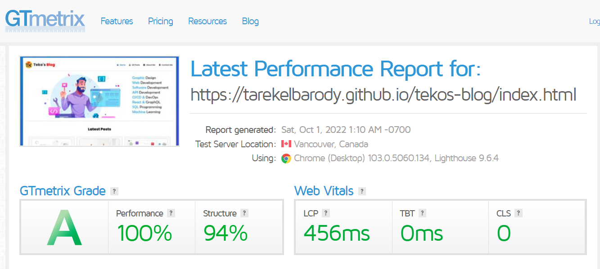

# Personal Blog

Personal Blog Starter Using HTML, CSS, And JavaScript

Project Deployment page:
https://tarekelbarody.github.io/tekos-blog/index.html

## Page Quality & Performance

-   Responsive Pages work on multi devices
-   Following best practices guide and code writing
-   Valid CSS & HTML with W3C Markup Validation Service.
-   GTMetrix Grade A
-   Dev tools lighthouse very good Accessibility & SEO & Performance

## Dev tools lighthouse Screenshots

## GTMetrix Grade Screenshots

